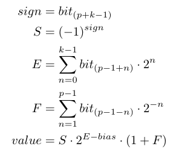
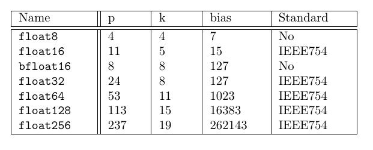

# Float-IEEE754-didactic

Educational python module to parse floats and inspect the
IEEE 754 representation internals.

## Use case

It might be used to get a glimpse of how the IEEE 754 model works.
This means that it could be used almost exclusively for educational
purposes.

## Brief example

Create 3 floats using the float32 specification and print them
as floats:
```python
from floatedu import Float32

f_1 = Float32("0 01111111 00000000000000000000000")
f_1234 = Float32("0 10001001 00110100100111010011101")
f_inf = Float32("0 11111111 00000000000000000000000")

print(f1, f_1234, f_inf)

# 1.0 1234.4566650390625 inf
```

Print number values as per general formula:
```python
print(repr(f_1234))

# {'value': float('1234.4566650390625'),
#  'kind': 'normal', 'k': 8, 'p': 24, 'bias': 127,
#  'bits': '0_10001001_00110100100111010011101',
#  'sign': 1, 'exponent': 137, 'fraction': 0.20552408695220947,
#  'significand': 1.2055240869522095,
# }
```

## Implemented types and formula

The formula implemented for a normal number is:



The specification defines various types of binary floats.
This module implements all of them plus something non-standard.



They're available as classes with matching names:
```python
from floatedu import *
[Float, Float16, BFloat16, Float64, Float32, Float128, Float256]
```

The implementation class is `Float` and could not be instantiated
directly. To use it it must be subclassed providing `p`, `k`, and `bias`
values as class properties (see `Float.py`).
