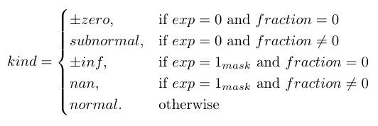
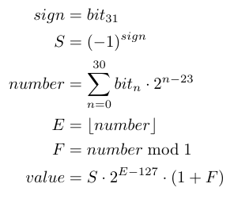

# Float-IEEE754-didactic

Educational python module to parse floats and inspect the
IEEE 754 representation internals.

## Installation

No installation as of today.
Git clone the repository and run a python3 interpreter inside it. 

## Use case

It might be used to get a glimpse of how the IEEE 754 model works.
This means it's useful almost exclusively for educational
purposes.

## Brief example

Create 3 floats using the float32 specification and print them
as native floats:
```python
from floatedu import Float32

f_1 = Float32("0 01111111 00000000000000000000000")
f_num = Float32("0 10001001 00110100100111010011101")
f_inf = Float32("0 11111111 00000000000000000000000")

print(f_1, f_num, f_inf)

# 1.0 1234.4566650390625 inf
```

Print number details as per general formula:
```python
print(repr(f_num))

# {'value': float('1234.4566650390625'),
#  'kind': 'normal', 'k': 8, 'p': 24, 'bias': 127,
#  'bits': '0_10001001_00110100100111010011101',
#  'sign': 1, 'exponent': 137, 'fraction': 0.20552408695220947,
#  'significand': 1.2055240869522095,
# }
```

Everything is accessible as a property:
```python
print(f_num.kind, f_num.sign, f_num.exponent, f_num.fraction)

# normal 1 137 0.20552408695220947
```

`Float` numbers are subclass of `list` and can be updated live:
```python
print(f_num.sign_bits)
print(f_num.exponent_bits)
print(f_num.fraction_bits)
f_num.sign_bits[0] = 1 #  Make number negative
print(f_num)

# [0]
# [1, 0, 0, 0, 1, 0, 0, 1]
# [0, 0, 1, 1, 0, 1, 0, 0, 1, 0, 0, 1, 1, 1, 0, 1, 0, 0, 1, 1, 1, 0, 1]
# -1234.4566650390625
```

## Implemented types and formula

IEEE 754 defines various types of binary floats.
This module implements all of them plus something non-standard.


Bits are laid out from left to right as `sign - exponent - fraction`.

For example the `BFloat16` is stored as:


Every implemented float type is available as a class:
```python
from floatedu import *
[Float, Float8, Float16, BFloat16, Float64, Float32, Float128, Float256]
```

A number could be Zero, Infinity, Normal, Subnormal or Not a number.

The type is determined by:



The formula implemented for a normal number is:

[eq_float_value]: doc/img/eq_float_value.png "General formula"
![General formula for floats][eq_float_value]

Hence, the float32 formula becomes:

[eq_float32_value]: doc/img/eq_float32_value.png "float32 formula"
![Formula for float32][eq_float32_value]

An another way to think about this formula is to consider the stored
number as a fixed point binary number with sign bit.

In this case, the integer part would be the exponent and the fractional
part (plus 1) would be the significand. I.e.



The actual implementation class is `Float` and it couldn't be instantiated
directly.

It must be subclassed providing `p`, `k`, and `bias` values as class
properties (see `floatedu/Float.py`).
